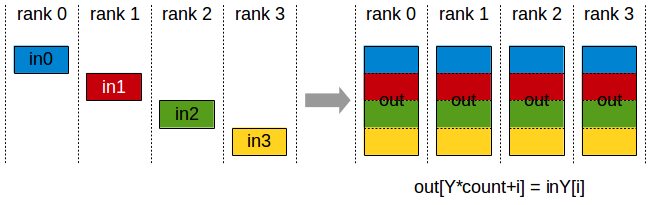

+++
title = '集合通讯学习1-NCCL与集合通讯原语'
date = '2026-06-15T16:39:20+08:00'
draft = false
description = '介绍NCCL API和集合通讯原语'
readingTimeText = '阅读此文大概需要31分钟'
tags = ['NCCL','Collective Communication','CUDA','Distributed Training']
categories = ['Technical Blog']
+++

# NCCL

上一篇文章介绍了分布式计算和硬件网络，这一篇我们终于进入集合通讯本身。在这一篇里我们简单介绍NCCL和通讯原语，不做过多的拓扑感知优化算法介绍。

在ML system里，NCCL（NVIDIA Collective Communication Library）几乎是绕不开的组件。PyTorch DDP、Megatron-LM、DeepSpeed、vLLM等系统里大量跨GPU通信最终都会落到NCCL或者类似的通信库上。

NCCLw为我们提供了足够的抽象，但它背后真正发生的是多个rank上的GPU按照某种通信算法，把显存中的tensor通过NVLink、PCIe、InfiniBand或者RoCE交换出去，再把结果写回显存。

在这节中我们简要介绍NCCL里面的一些概念和API，然后介绍现在NV生态中主流的通信库，具体的代码和实验将留在下几章。
## NCCL API

NCCL里的几个基础概念需要先说清楚：rank、communicator、stream、buffer。

**Rank**表示当前进程或当前GPU在通信组里的编号。如果一个通信组里有`p`个rank，那么rank编号通常是`0 ~ p-1`。集合通讯的语义都建立在rank集合之上。

``` plain text
rank 0 -> GPU0
rank 1 -> GPU1
rank 2 -> GPU2
rank 3 -> GPU3
```

**Communicator**表示一组rank共同参与通信的上下文。它记录了这个通信组中有多少rank、当前rank是谁、对应哪张CUDA device，以及NCCL为这组rank建立的内部连接状态。可以把它粗略理解为MPI里的`MPI_Comm`。

创建communicator时，一般需要先在某个进程中生成一个`ncclUniqueId`，然后把这个ID通过MPI、socket、文件系统或者其他CPU侧通信方式分发给所有rank。每个rank拿到同一个ID之后，再调用`ncclCommInitRank`加入同一个通信组。

``` C++
ncclUniqueId id;
ncclGetUniqueId(&id);

// broadcast id to all ranks by MPI/socket/etc.

ncclComm_t comm;
ncclCommInitRank(&comm, nranks, id, rank);
```

这里有一个很容易忽略的点：NCCL本身负责GPU之间的高速通信，但communicator初始化时的`ncclUniqueId`分发通常仍然需要依赖CPU侧的进程管理系统。也就是说，NCCL不是一个完整的分布式任务启动框架，它通常和MPI、torchrun、Kubernetes、Slurm等系统一起使用。

**CUDA Stream**表示通信操作在哪个CUDA stream上提交。NCCL的collective API一般都会接收一个`cudaStream_t stream`参数。这意味着NCCL通信和普通CUDA kernel一样，进入CUDA stream的执行序列中。

``` C++
ncclAllReduce(sendbuff, recvbuff, count,
              ncclFloat, ncclSum, comm, stream);
```

如果这个stream上前面有计算kernel，那么通信会等待前面的kernel完成；如果后面还有计算kernel，那么后面的kernel会等待通信完成。这个设计让NCCL天然可以参与计算通信重叠，但是否真的能重叠，还取决于stream组织、数据依赖、kernel资源占用和硬件通信能力。

**Buffer**就是参与通信的显存地址。NCCL API通常接收`sendbuff`和`recvbuff`。有些操作支持in-place，也就是输入输出使用同一块buffer；有些操作不支持，或者对in-place位置有特殊要求。

把这些概念合起来，一个NCCL调用大概可以读成：

``` plain text
在comm描述的rank集合里，
用stream提交一个通信操作，
从sendbuff读取count个datatype元素，
按照op/root等参数定义的语义，
把结果写入recvbuff。
```

以AllReduce为例：

``` C++
ncclAllReduce(sendbuff,
              recvbuff,
              count,
              ncclFloat,
              ncclSum,
              comm,
              stream);
```

它的意思是：所有rank都提供一段长度为`count`的float数组，对每个位置做sum，然后每个rank都得到一份完全相同的结果。

``` plain text
rank0: [1, 2, 3]
rank1: [4, 5, 6]
rank2: [7, 8, 9]

AllReduce(sum)

rank0: [12, 15, 18]
rank1: [12, 15, 18]
rank2: [12, 15, 18]
```

NCCL还有一个很重要的机制：Group Call。多个NCCL操作可以被包在`ncclGroupStart()`和`ncclGroupEnd()`之间。

``` C++
ncclGroupStart();
for (int i = 0; i < ndev; ++i) {
    cudaSetDevice(devs[i]);
    ncclAllReduce(send[i], recv[i], count,
                  ncclFloat, ncclSum, comms[i], streams[i]);
}
ncclGroupEnd();
```

Group Call最常见的用途是单进程管理多张GPU时，把多张GPU上的通信操作一起提交。否则某一个NCCL调用可能会等待其他rank进入同一个collective，从而导致单线程逐个提交时出现阻塞。Group Call也可以让NCCL更好地看到一组操作的整体结构。

当然，NCCL不是魔法棒。它通常能替我们选择一个不错的算法和路径，但它无法改变问题本身的数据规模，也无法消除糟糕拓扑、错误rank映射、跨NUMA绕路、网络拥塞等系统问题。真正调训练性能时，我们往往既要看NCCL日志，也要看GPU利用率、网络流量、kernel timeline和框架层面的并行策略。

## GPU-Initiated Communication

前面介绍的NCCL API本质上仍然是host-initiated的。CPU调用`ncclAllReduce()`，NCCL在CUDA stream上提交通信kernel，然后GPU执行这段通信逻辑。对于AllReduce、AllGather这类规则collective来说，这个模型非常自然，因为通信模式在调用API之前就已经确定了。

但是现代LLM kernel里出现了另一类需求：通信决策本身发生在GPU kernel内部。最典型的例子就是MoE。router在GPU上为每个token选择expert，然后每个token需要被发送到对应expert所在的GPU。这个通信模式有几个特点：

1. 每个step的路由结果不同。
2. 每个rank发给其他rank的数据量不一定相同。
3. token dispatch、量化、通信、expert计算、combine最好能融合或流水起来。
4. 如果每次都回到CPU提交通信，延迟和同步开销会非常难看。

这就是GPU-Initiated Communication的动机。我们希望GPU kernel在知道路由结果之后，可以直接发起远端写入、远端读取或者同步信号，而不是先停下来把控制权交回CPU。

在GIN进入NCCL生态之前，这类需求最常见的答案是NVSHMEM。

## Side Note: NVSHMEM

既然问题走到了GPU端主动通信，就必须先介绍NVSHMEM。它和NCCL经常出现在同一个语境里，但编程模型并不一样。

NCCL主要面向集合通讯。使用者调用`AllReduce`、`Broadcast`、`ReduceScatter`等高层原语，一组rank共同进入同一个通信操作。NCCL的通信粒度比较大，开销也比较高。

NVSHMEM则实现了OpenSHMEM风格的PGAS（Partitioned Global Address Space）编程模型。简单来说，它让多张GPU上的一部分内存组成一个逻辑上的分布式共享地址空间，程序可以从CPU、CUDA stream或者CUDA kernel内部发起更细粒度的GPU-GPU通信。可以实现直接在kernel内部向外部某段内存直写。

这里的PE（Processing Element）可以粗略理解为NVSHMEM世界里的rank。NVSHMEM的关键点包括：

1. **Symmetric Memory**：不同PE上分配形状一致、可互相寻址的内存区域。
2. **One-sided Communication**：一侧发起put/get，远端不一定需要同时调用匹配的recv。
3. **GPU-Initiated Communication**：通信可以从GPU kernel内部发起，而不一定每次都回到CPU提交NCCL操作。

这使得NVSHMEM很适合一些细粒度、动态、和计算kernel强耦合的通信场景。比如MoE中的专家路由、稀疏通信、图计算或者某些自定义通信kernel。如果通信模式非常规则，且可以表达成标准collective，那么NCCL通常更直接并且优化更好。如果需要在kernel内部做更灵活的远端读写，传统上NVSHMEM就会变得很有吸引力。

DeepEP一类MoE通信库之所以能做到很低延迟，一个重要原因就是它们没有把token dispatch拆成“GPU算路由 -> 回CPU -> 调通信库 -> 再回GPU”这样的路径，而是在GPU端直接驱动远端写入和同步。这个设计非常适合MoE，但是也带来一个工程问题：训练框架主路径通常已经依赖NCCL，而MoE kernel又要额外维护一套NVSHMEM runtime、对称内存模型、初始化流程和调试工具。

NCCL GIN的出现就是为了解决这个问题，能不能把GPU端主动通信这件事，重新纳入NCCL自己的通信体系里？

## NCCL GIN API

NCCL GIN（GPU-Initiated Networking）可以理解为NCCL Device API在跨节点网络上的这一块能力。NCCL 2.28开始引入Device API，大致可以分成三类路径：

``` plain text
LSA:      Load/Store Accessible, 面向NVLink/PCIe可直接load/store的peer memory
Multimem: 面向NVLink域内的多播/归约类内存操作
GIN:      GPU-Initiated Networking, 面向跨节点RDMA网络
```

GIN要解决的问题是：让CUDA kernel能够发起跨节点RDMA操作，而不是每次都由CPU在host侧提交通信。它通常包含两层准备工作。

第一层是host侧初始化。程序仍然需要创建NCCL communicator，注册可被远端访问的memory window，建立device communicator或者相关网络资源。也就是说，连接建立、内存注册、权限和拓扑发现这些事情仍然由host侧完成。

``` plain text
host side:
create NCCL comm
register communication buffers / memory windows
prepare device-side communication handles
launch CUDA kernel
```

第二层是device侧通信。CUDA kernel拿到host预先准备好的device handle之后，可以在kernel内部执行远端put/get、signal/wait等操作。这里的名字在不同论文或版本中可能会略有变化，但语义大概如下：

``` plain text
device side:
put   local data -> remote GPU memory
get   remote GPU memory -> local data
signal remote counter / flag
wait  until remote signal reaches expected value
```

这样一来，通信就可以被写进业务kernel的控制流里。对于MoE dispatch来说，kernel可以一边读取router结果，一边把token按目标expert写入远端GPU的接收buffer，并用signal通知对端已经写完某个chunk。combine阶段则反过来，把expert输出按原token位置送回源rank。

这里说GIN“代替NVSHMEM”，更准确地讲，是在现代NVIDIA训练/推理kernel中，GIN提供了一条把GPU端RDMA能力纳入NCCL生态的路径。NVSHMEM的优势是PGAS模型成熟，GPU端put/get表达直接；但对于本来已经大量依赖NCCL的训练框架来说，GIN能减少通信栈割裂。

GIN的吸引力在于它把这类能力收回到NCCL体系里：

1. **统一runtime**：collective通信和GPU-initiated RDMA都可以围绕NCCL communicator和NCCL资源管理展开。
2. **拓扑感知**：NCCL已经知道GPU、NIC、NVLink、PCIe和网络插件的信息，GIN可以复用这些拓扑能力。
3. **更容易集成框架**：PyTorch、Megatron、vLLM等系统本来就有NCCL初始化路径，不必为了MoE kernel再维护一套完全独立的NVSHMEM环境。
4. **更适合产品化**：部署、日志、调参、网络插件、故障定位都能尽量回到NCCL生态中。

这件事在NCCL EP（Expert Parallelism）的设计里体现得很明显。NCCL EP把MoE里的dispatch和combine抽象成更高层的`ncclEpDispatch`和`ncclEpCombine`。底层kernel可以使用NCCL Device API：节点内优先走NVLink/LSA这类直接访问路径，跨节点则用GIN发起RDMA。这样它能保留DeepEP、Hybrid-EP这类现代MoE kernel“GPU端发通信、通信计算融合”的优点，同时减少对NVSHMEM或其他独立通信栈的依赖。

当然，GIN并不是要让所有场景都抛弃NVSHMEM。NVSHMEM仍然是一个通用的PGAS编程模型，适合需要显式远端内存语义的HPC或不规则应用。GIN更像是NCCL给深度学习通信kernel补上的一块能力：当你的应用已经在NCCL生态里，并且主要需求是MoE dispatch/combine、细粒度RDMA、计算通信融合时，使用GIN可以让GPU-initiated communication和标准collective共享同一套通信基础设施。

# Collective Communication Primitive

集合通讯原语可以分成两类：基础原语和组合原语。

基础原语包括Broadcast、Gather、Reduce、Scatter。它们通常围绕一个root rank展开，要么从root向外发，要么从其他rank向root收。

组合原语包括AllGather、AllReduce、ReduceScatter、AlltoAll。它们可以看作基础原语的组合或推广，通常所有rank都会得到一部分或全部结果。现代深度学习训练里，组合原语出现得更频繁，因为我们常常希望所有GPU都继续拥有下一步计算所需的数据。

需要注意的是，这里说的是集合通讯的语义分类，不完全等于NCCL直接暴露的API列表。NCCL常用collective API包括Broadcast、Reduce、AllReduce、AllGather、ReduceScatter等；Gather、Scatter、AlltoAll这类语义可以通过Send/Recv或上层框架组合出来，但不一定是NCCL中的一等collective API。理解原语语义仍然很重要，因为很多训练框架会在更高层把这些通信模式包装好。

本文的notation如下。rank0-4表示4个rank，每个rank有一个数组in[]。

``` plain text
rank0: in0
rank1: in1
rank2: in2
rank3: in3
```

如果数组内部还有元素，我们用`inX[i]`表示。下面的图主要强调rank之间的数据流向，不纠结具体算法是Ring、Tree还是分层实现。

## Base Primitive

### Broadcast

Broadcast表示从一个root rank出发，把同一份数据发送给通信组里的所有rank。


Broadcast的核心语义是“一份数据，多处复制”。它常见于参数初始化、配置同步、随机种子同步、某些控制信息同步等场景。

在训练系统中，Broadcast有时也用于把root上的参数同步到其他rank。不过在标准数据并行训练里，参数同步更多是通过梯度AllReduce之后每个rank本地执行相同optimizer step来保持一致，而不是每一步都Broadcast完整参数。

### Gather

Gather表示所有rank把各自的数据发送到一个root rank，root按照rank顺序把它们拼接起来。


Gather的核心语义是“多份数据，集中到root”。它适合做日志聚合、评估结果收集、少量metadata汇总等场景。

不过在大规模训练的主路径中，Gather不如AllGather常见。原因很简单：如果只有root拿到完整结果，那么后续计算也只能由root继续做，其他rank会闲着。对于追求并行效率的训练系统，我们通常希望所有rank都能继续工作，所以更常用AllGather。

如果实现Gather，root的`recvbuff`需要足够大，可以容纳所有rank的数据。rank `i`的数据通常会被放到root接收buffer的第`i`段。


### Reduce

Reduce表示所有rank提供一份同样形状的数据，然后按照某个归约操作合并，最终结果只放在root rank上。


Reduce中的`op`可以是sum、prod、min、max等。机器学习里最常见的是sum，因为梯度同步通常需要把不同rank上的梯度加起来，再除以world size得到平均梯度。

如果我们只关心root上的结果，Reduce就够了。比如分布式评估时，把每个rank统计到的loss总和、样本数量归约到rank0，最后只在rank0打印指标。

但在数据并行训练里，每个rank下一步都需要同样的梯度结果。单纯Reduce只把结果放到root，其他rank还没有结果。因此训练主路径里更常见的是AllReduce，也就是Reduce之后再Broadcast。

### Scatter

Scatter和Gather方向相反。root rank持有一整块数据，然后把不同片段发送给不同rank。


Scatter的核心语义是“一份大数据，切分到多个rank”。它可以用于数据分发、参数分片、任务分配等场景。

和Gather类似，Scatter在训练主路径中也没有AllGather、ReduceScatter那么常见。因为现代训练系统通常从一开始就让每个rank读取自己的数据分片，或者让参数/优化器状态长期保持分片状态，而不是每一步都由root切一遍再发出去。

## Combinational Primitive

组合原语通常可以由基础原语拼出来，但实际通信库不会真的机械地先做一个基础原语再做另一个基础原语。NCCL会根据消息大小、rank数量和拓扑选择更合适的算法。这里说“组合”，主要是为了理解它们的语义。

### AllGather

AllGather可以理解为Gather之后再把Gather结果Broadcast给所有rank。每个rank贡献一份数据，最后每个rank都得到所有rank数据的拼接。




AllGather的特点是输出比输入大。每个rank输入`N`个元素，输出通常是`p * N`个元素，其中`p`是rank数量。这一点在显存估算中很重要。

AllGather在模型并行和参数分片训练里非常常见。例如ZeRO/FSDP一类方法会把参数分片存储在不同rank上。在某一层真正计算前，需要把这一层的参数分片AllGather回来，让每个rank临时拿到完整参数，然后执行forward/backward。这也是为什么大模型训练里AllGather经常出现在timeline上。它不一定像AllReduce那样被初学者第一时间注意到，但对分片训练的性能非常关键。

### AllReduce

AllReduce可以理解为Reduce之后再Broadcast。所有rank提供同样形状的数据，先做归约，然后每个rank都得到完整归约结果。


AllReduce是数据并行训练中最经典的集合通讯原语。每个rank处理不同mini-batch，backward之后得到本地梯度。为了让每个rank的模型参数保持一致，需要把所有rank的梯度求和或求平均。之后每个rank用相同梯度执行optimizer step，模型参数就能保持一致。很多框架会在AllReduce之后除以world size，也有些框架会在loss或梯度计算阶段提前处理平均系数。这里的细节要看具体框架实现。

从通信量角度看，AllReduce非常重要，因为梯度大小通常和模型参数量同阶。模型越大，每一步需要同步的数据就越多。所以数据并行扩展到大规模时，AllReduce往往是第一个被拿出来分析的通信瓶颈。

### ReduceScatter

ReduceScatter可以理解为Reduce和Scatter的组合。所有rank提供一整块数据，先按元素做归约，然后把归约后的结果切成`p`块，每个rank只拿其中一块。


其中：out0 = in0[0] + in1[0] + in2[0] + in3[0]，以此类推

ReduceScatter的输出比输入小。每个rank输入`p * N`个元素，输出`N`个元素。它经常和AllGather成对出现。

在Ring AllReduce的语义分解中，一个AllReduce可以拆成：

``` plain text
AllReduce = ReduceScatter + AllGather
```

第一阶段ReduceScatter让每个rank得到一片归约结果，第二阶段AllGather再把所有片段收集到每个rank上。实际NCCL内部是否这样执行，要看算法选择和硬件拓扑，但这个分解非常有助于理解AllReduce。

ReduceScatter在ZeRO、FSDP、Tensor Parallel等系统中也很重要。比如梯度归约后，每个rank只需要保留自己负责更新的梯度分片，那么就不必把完整梯度留在每个rank上。相比AllReduce，ReduceScatter可以减少每个rank最终持有的数据量。

### AlltoAll

AlltoAll是最“全连接”的集合通讯原语。每个rank都有一块数据要发给每个其他rank，同时也会从每个其他rank接收一块数据。


可以把AlltoAll理解成一个分布式矩阵转置。原来每一行属于一个发送rank，转置之后每一行属于一个接收rank。

AlltoAll在MoE中非常关键。MoE layer里，每个token会被router分配给某个expert，而expert通常分布在不同GPU上。于是每个rank上的token需要按照目标expert重新分发到其他rank；expert计算完成后，结果又需要按照原token位置发回来。这种“每个rank都给每个rank发不同内容”的模式，就是AlltoAll非常典型的用武之地。

AlltoAll的挑战也最明显：它的通信模式非常密集，容易打满网络，也更容易暴露负载不均衡。如果router把太多token分给某些expert，对应rank就会收到更多数据并执行更多计算。此时瓶颈不只是通信库，还包括模型路由、expert placement、网络拓扑和负载均衡策略。

在NCCL里，AlltoAll通常不是像AllReduce那样的一个单独collective调用，而是通过多组`ncclSend`/`ncclRecv`或者框架层的封装来表达。对于使用PyTorch或者Megatron这类框架的开发者来说，可能看到的是更高层的`all_to_all`接口；对于通信库实现者来说，它背后仍然要落到大量点对点数据交换和拓扑调度上。

# 写在最后

本文介绍了NCCL的基本编程模型，以及常见集合通讯原语的语义。这里最重要的不是背API参数，而是建立一个形状直觉：

``` plain text
Broadcast:     one -> all
Gather:        all -> one
Reduce:        all -(op)-> one
Scatter:       one -> all slices
AllGather:     all -> all concatenated
AllReduce:     all -(op)-> all
ReduceScatter: all -(op)-> all slices
AlltoAll:      all slices -> all slices
```

理解这些原语之后，再看训练系统里的通信就会清晰很多。数据并行里的梯度同步是AllReduce；参数分片训练里的参数重建常常是AllGather；分片梯度归约常常是ReduceScatter；MoE里的token dispatch则大量依赖AlltoAll。


下一篇文章会进一步讨论具体的拓扑和这些原语在具体的拓扑上如何实现，比如Ring AllReduce为什么可以拆成ReduceScatter和AllGather，Tree为什么适合小消息。

# Reference

https://docs.nvidia.com/deeplearning/nccl/user-guide/docs/api/colls.html

https://docs.nvidia.com/deeplearning/nccl/user-guide/docs/usage/communicators.html

https://docs.nvidia.com/nvshmem/api/index.html

https://arxiv.org/abs/2511.15076

https://arxiv.org/abs/2603.13606

图片均来自于nvidia nccl user guide
